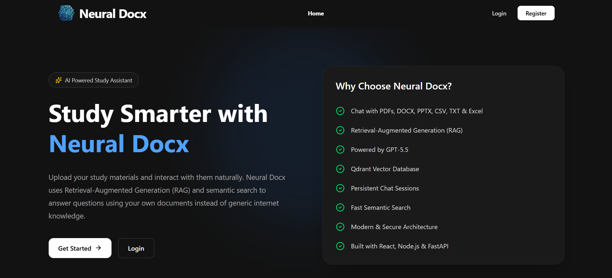
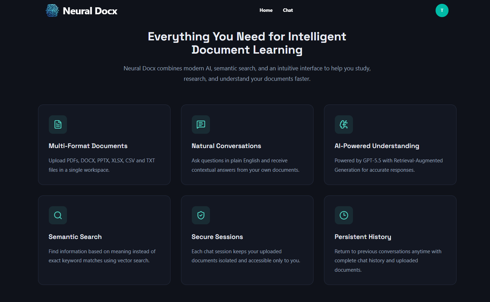
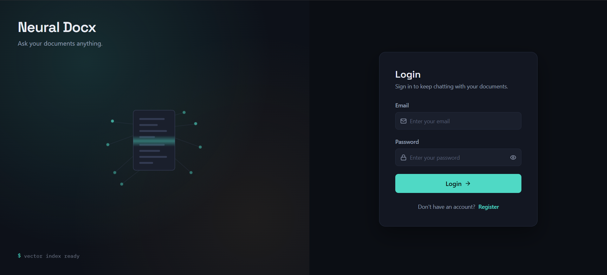
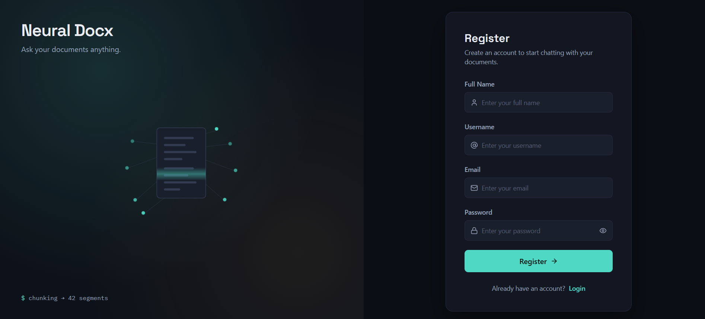
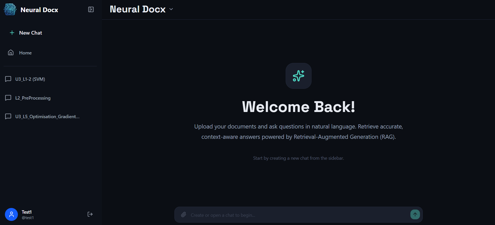
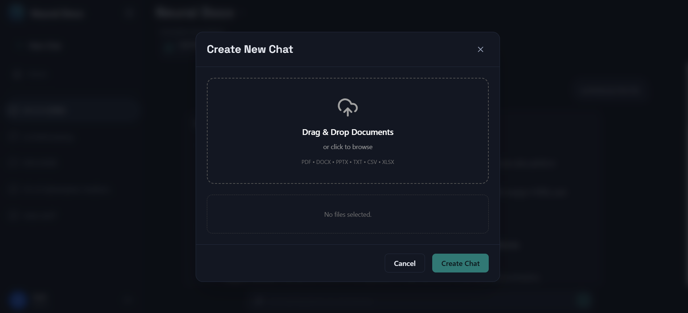
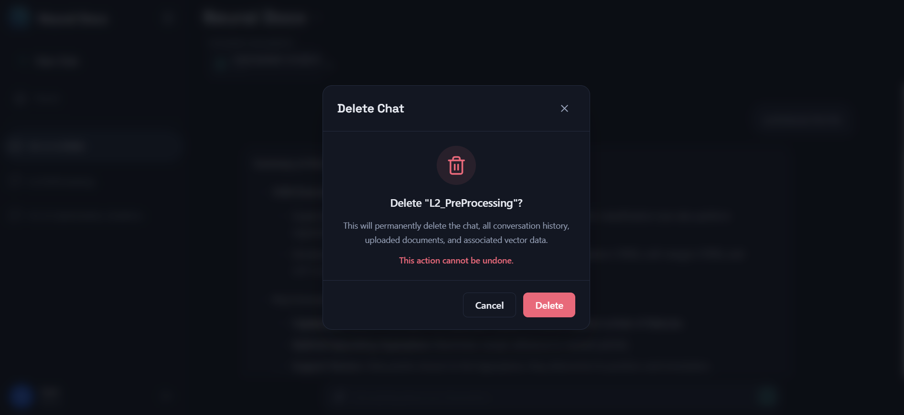
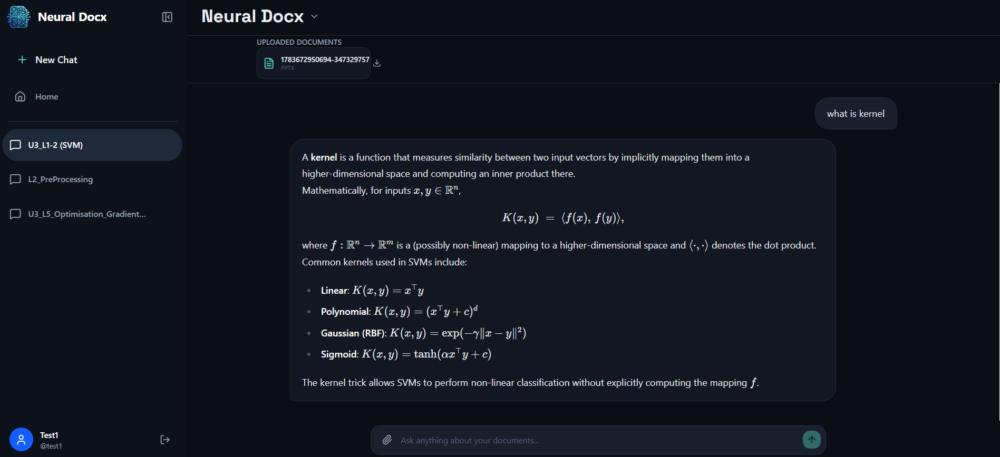
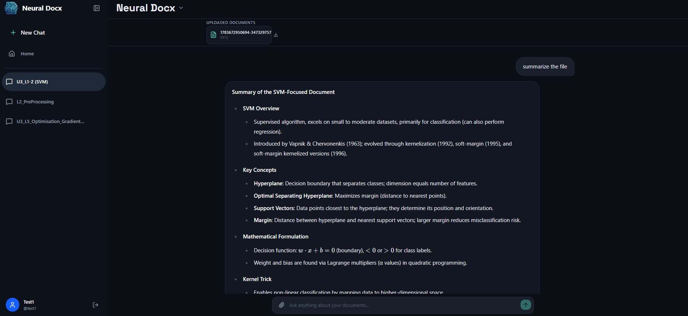

# Neural Docx

<p align="center">
  
</p>

<h3 align="center">
AI-Powered Document Intelligence Platform
</h3>

<p align="center">
Upload documents, chat with them using Retrieval-Augmented Generation (RAG), and manage intelligent conversations with persistent memory.
</p>

<p align="center">


</p>

---

# Live Demo

🌐 **Application:** https://neural-docx.vercel.app/

---

# Overview

Neural Docx is an AI-powered document question answering platform that enables users to upload multiple documents in multiple formats and interact with them through natural language conversations.

Instead of manually searching through lengthy PDFs, presentations, spreadsheets, or Word documents, users can simply ask questions. The application retrieves the most relevant document content using semantic search and generates contextual responses using a Retrieval-Augmented Generation (RAG) pipeline.

The platform supports persistent chat sessions, conversation memory, multiple document uploads, semantic retrieval, and secure user authentication.

---

# Key Features

## Authentication

- Secure user registration
- Email OTP verification
- JWT Authentication
- Protected routes

---

## Intelligent Document Chat

- Upload multiple documents
- Ask natural language questions
- Context-aware follow-up conversations
- Persistent conversation history
- Session-based document retrieval

---

## Supported File Types

- PDF
- DOCX
- PPTX
- XLSX
- CSV
- TXT

---

## AI Capabilities

- Retrieval-Augmented Generation (RAG)
- Semantic document search
- Conversation memory
- History-aware retrieval
- Multi-document reasoning
- Metadata filtering using Qdrant

---

## Chat Management

- Create chat sessions
- Delete chat sessions
- View uploaded documents
- Download uploaded files
- Open uploaded documents

---

## Landing Page

- Responsive landing page
- Application analytics
- Modern UI
- Responsive design

---

# System Architecture

```text
                     User
                      │
                      ▼
                 React Frontend
                      │
                      ▼
               Express Backend <──> Cloudinary File Storage
            (Authentication/API)
                      │
        ┌─────────────┴─────────────┐
        ▼                           ▼
  MongoDB Storage           FastAPI RAG Server
 (Users/Sessions)           (In-Memory Staging)
                                    │
                          LangChain RAG Pipeline
                                    │
                          History Aware Retriever
                                    │
                                    ▼
                            OpenAI Embeddings
                                    │
                                    ▼
                            Qdrant Vector Database
                                    │
                                    ▼
                                Groq LLM


---

# How It Works

### Step 1

User uploads one or more documents.

↓

### Step 2

Documents are parsed and converted into LangChain `Document` objects.

↓

### Step 3

Large documents are divided into smaller semantic chunks.

↓

### Step 4

Each chunk is converted into vector embeddings using OpenAI embedding model.

↓

### Step 5

Embeddings are stored in Qdrant along with metadata such as

- Session ID
- Document ID
- File Name
- Chunk Index

↓

### Step 6

When the user asks a question:

- Previous conversation history is loaded.
- LangChain rewrites follow-up questions when necessary.
- Qdrant retrieves the most relevant chunks.
- Retrieved context is passed to the language model.

↓

### Step 7

The generated response is returned to the user and stored as part of the conversation history.

---

# Tech Stack

## Frontend

- React
- Redux Toolkit
- React Router
- Axios
- Tailwind CSS
- React Hot Toast
- Lucide Icons

---

## Backend

- Node.js
- Express.js
- MongoDB
- Mongoose
- JWT Authentication
- Cloudinary

---

## AI Server

- FastAPI
- LangChain
- LangChain Groq
- LangChain Qdrant
- OpenAI Embeddings
- Recursive Character Text Splitter

---

## Vector Database

- Qdrant Cloud

---

## Deployment

### Frontend

- Vercel

### Backend

- Vercel

### AI Server

- Google Cloud Run 

### Database

- MongoDB Atlas

### Vector Database

- Qdrant Cloud

### File Storage

- Cloudinary

---

# Project Structure

```text
Neural-Docx/

├── Client/                 # React Frontend
│
├── Server/                 # Express Backend
│
├── RAG_App/         # AI Server
│
└── README.md
```

---

# Screenshots

## Home Page



---

## Feature



---

## Login



---

## Register 




## Chat Dashboard



---

## Create Chat



---

## Delete Chat



---

## AI Conversation




---

# Installation

Clone the repository

```bash
git clone https://github.com/keshavk27/Neural_Docx
```

Frontend

```bash
cd Client
npm install
npm run dev
```

Backend

```bash
cd Server
npm install
npm run dev
```

AI Server

```bash
cd RAG_App
pip install -r requirements.txt
uvicorn app:app --reload port ${PORT}
```

---


# Future Improvements

- Streaming AI responses
- Source citations
- OCR support
- Image understanding
- Voice interaction
- Chat export
- Team collaboration
- Shared workspaces

---


---

# Author

**Keshavk27**

If you found this project helpful, consider giving it a ⭐ on GitHub.